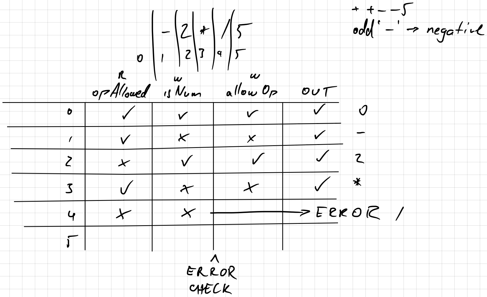
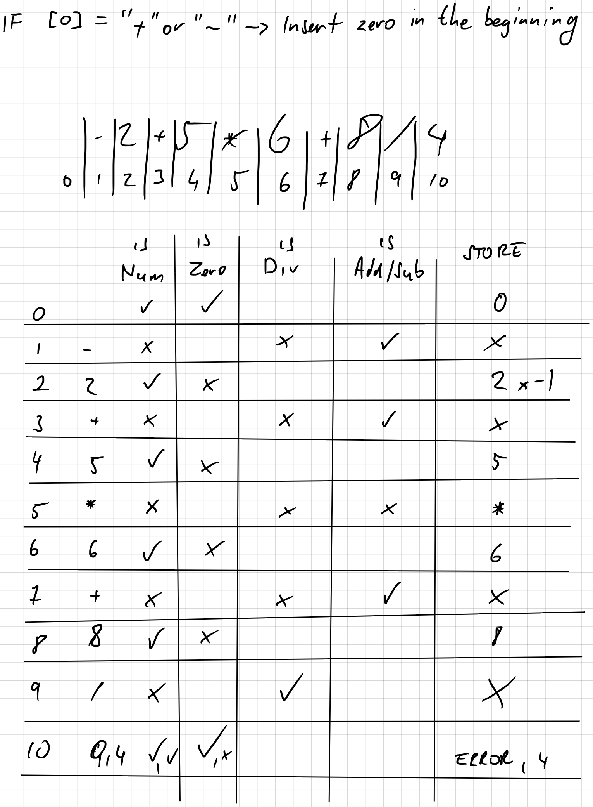
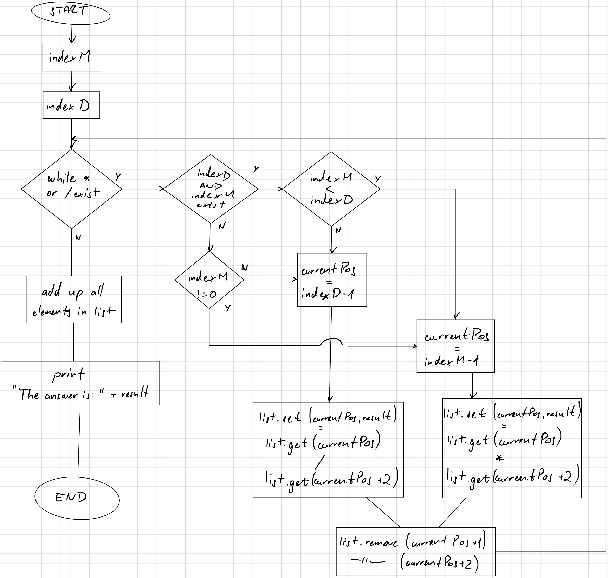

#notes #java #linkedlist
# Sketches



# Learning Java LinkedList
[Java server with imported LinkedList](https://www.w3schools.com/java/tryjava.asp?filename=demo_linkedlist_add)
```java
import java.util.LinkedList;

public class Main { 
  public static void main(String[] args) { 
    LinkedList<String> list = new LinkedList<String>();
    float result = 0;
    String a = "5";
    String b = "-7";
    String mult = "*";
    String div = "/";
    
    
    list.add(a);
    list.add(mult);
	list.add(b);
    list.add(b);

    System.out.println(list);
    
    while(list.contains("/")||list.contains("*")){
    	
    }
    
  } 
}

```
