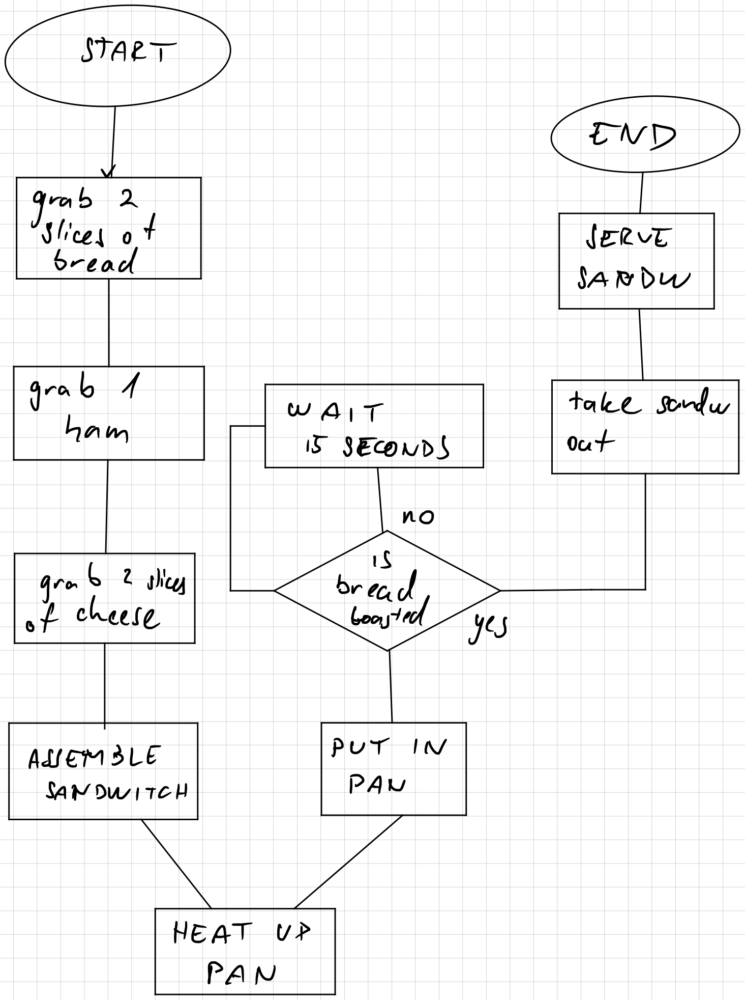

# What is programming
[Presentation](../TeachingContent/WhatIsProgramming.pptx)
- Cluster with 2 units
- 3 assessments
- failing 1 unit = failing the whole cluster
- communicate with the teachers
- Assessment  1 - Quiz
	- should be easy to pass if attend all classes
- TAFE has licence for MS Copilot
- Backup! Backup! Backup!
- The ability to find good answers is an important ability
- WPF, XAML, SQL
##### Required software
- Visual Studio
## What is programming
- A set of instructions
- Anyone can write code. Programming aka solving problems well is a harder task.
## History of computing
- 1843 - [Ada Lovelace](https://en.wikipedia.org/wiki/Ada_Lovelace)<br>
- 1936 - [Alan Turing](https://en.wikipedia.org/wiki/Alan_Turing)<br>
- 1943 - [Colossus Computer](https://en.wikipedia.org/wiki/Colossus_computer)<br>
	- The first programmable computer<br>
- 1946 - [ENIAC](https://en.wikipedia.org/wiki/ENIAC)<br>
	- The first general-purpose computer<br>
- 1947 - [Harvard Mark I & II](https://en.wikipedia.org/wiki/Harvard_Mark_I)<br>
- 1949 - Assembly<br>
- 1983 - C++, O-C<br>
- 1991 - Python, VB<br>
- 2000 - C#<br>
- 2009 - Go<br>
- 2014 - Swift<br>
## Software Dev
[(Video) Software Development Lifecycle in 9 minutes!](https://www.youtube.com/watch?v=i-QyW8D3ei0)


## Algorithm
- Unambiguous sequence of steps to reach a goal
- Start with pseudocode and copy them as comments to the code
- Good algo:
	- Always executes the solution without issues and nothing else.
	- Is reasonably efficient
	- Can be easily scaled
- [(Video) Pseudocode](https://www.youtube.com/watch?v=6hfOvs8pY1k)
- [(Video) Flowcharts](https://www.youtube.com/watch?v=SWRDqTx8d4k)

### Flowchart class activity
### Pour Milk
### Make a ham & cheese sandwich

### Move the Pen
## Variables
- Contains the reference to a location in a memory
- Represented by a name/label that we give it
## Big O notation
[Explanation and examples](https://www.linkedin.com/pulse/big-o-notation-simple-explanation-examples-pamela-lovett/)

### Compiler vs Interpreter
## Intro to C\#
[Presentation](../TeachingContent/GettingStartedWithCsharp.pptx)
### Value types
- when assigning another variable, the value is copied
```csharp
int a = 5;
int b = 2;
Console.WriteLine(a + " " + b);

b = a;
a += 10;
Console.WriteLine(a + " " + b);
```
Output
```
5 2
10 5
```
### Reference Types
- assigning variables, do not just copy the values but also a reference
	- when original variable changes, it affects all other variables it has been copied to
